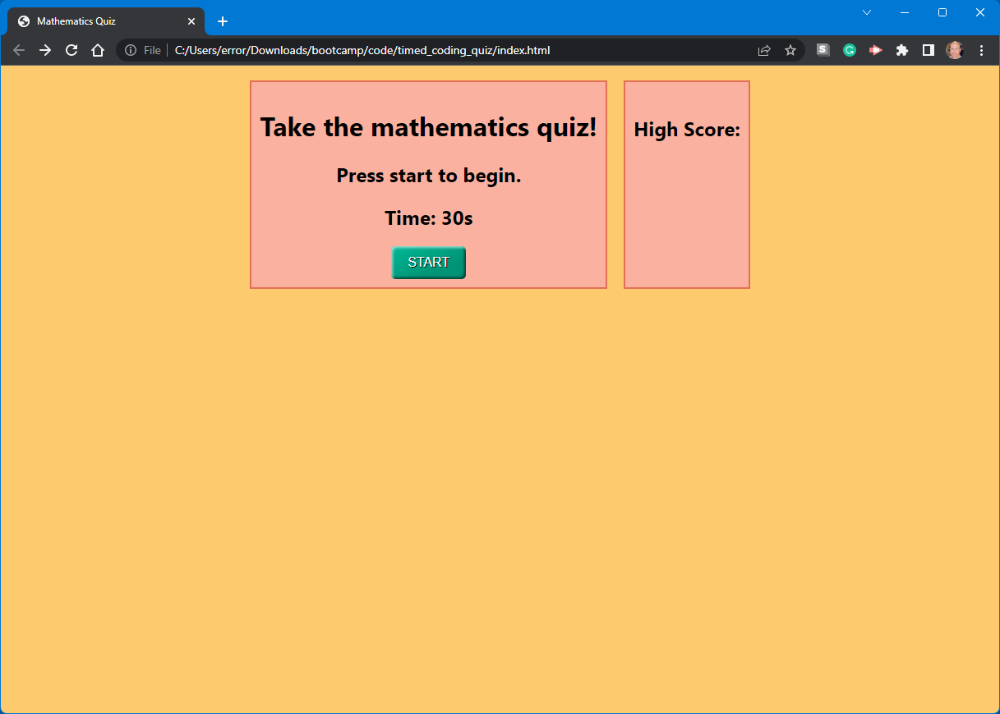

# <Your-Project-Title>

## Description

This was a project to build a timed quiz using html, css, and javascript. I learned how to use css, delegated event listeners, and most importantly, how to manupulate the DOM using JQuery.

## Table of Contents (Optional)

If your README is long, add a table of contents to make it easy for users to find what they need.

- [Installation](#installation)
- [Usage](#usage)
- [Credits](#credits)
- [License](#license)

## Installation

Please feel free to fork and/or clone this repository.
To clone, at the command prompt type:
```
git clone git@github.com:error201/timed_coding_quiz.git
```

## Usage

Press the start button to begin the quiz. Answer the questions by clicking the appropriate button. If you receive the high score, enter your initials.

md


## Credits

All questions were cultivated at https://dorkygeekynerdy.com/quiz/ep13-1-mathematics-trivia

## License

This project is covered under the MIT license. Please read LICENSE.txt for details.

---

## Badges


## How to Contribute

Please feel free to fork and/or clone this repository.
